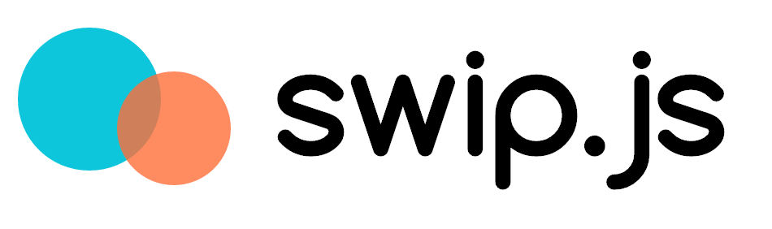
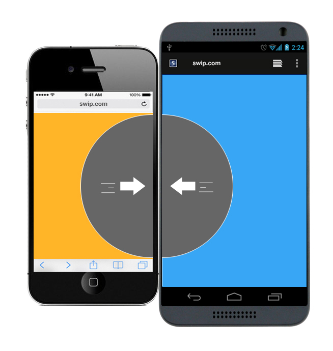
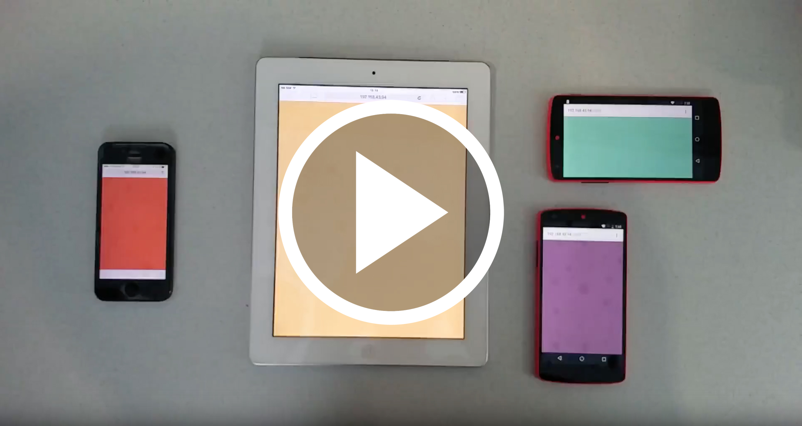
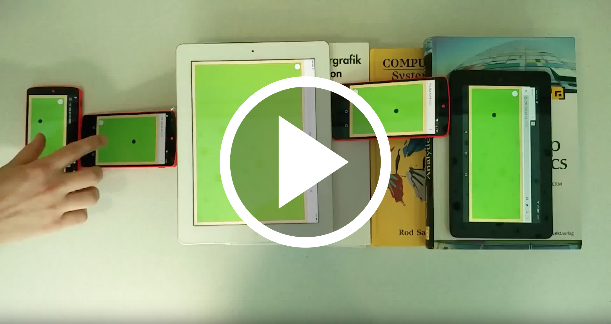

> **DISCLAIMER**
> 
> This is a very early version of Swip.js. If the app doesn't respond you might have to reload the browser or restart the server.
> It works best if you create a separate wireless network to connect multiple devices with your swip.js application 



# **Swip**

[](https://github.com/timgrossmann/InstaPy/blob/master/LICENSE)
[](https://www.javascript.com)

### [Read the article about it here](https://medium.freecodecamp.com/what-if-all-your-mobile-devices-formed-a-single-screen-9c6ff01ed0c3)

## What if all your mobile devices were a single screen?…
> This probably isn’t the most common question to ask yourself. But, just for a second, actually think about it, think about all the possibilities when being able to combine any kind of mobile devices, independent of the operating system… Welcome to swip.js



## Features
- [x] Runs in the browser
    - [x] Completely platform independent
    - [x] Works on every device with a browser
- [x] Open Source
    - [x] Free
    - [x] Open 
    - [x] Community-based
    - [x] Collaborate!
- [x] A library for you to use with your own project
    - [x] If you have an idea about what to build, do it!
    - [x] Two different examples
    - [x] Endless possibilities

## What we built with it
### Blobparticles
<a href="https://www.youtube.com/watch?v=qXOwT0ieOgw" target="_blank"></a>

### Minigolf
<a href="https://www.youtube.com/watch?v=ZE0gxa-p8HY" target="_blank"></a>

## Try it out yourself!

> You need node >= 6.x to run swip. To use swip you need to install its dependencies, the dependencies for the demos and build the client library. You can just run the commands below:

###### Setup
```bash
npm install webpack -g
npm install
cd examples/golf
npm install
cd ../particles
npm install
cd ../..
npm run build
```

###### Run the demos
```bash
npm run golf
npm run particles
```

## Who we are
[](http://github.com/paulsonnentag)   
**Paul Sonnentag**   
[](https://twitter.com/paulsonnentag)
[](http://paulsonnentag.com)
[](mailto:paul.sonnentag@gmail.com)
> Passionate developer, studying computer science. At home on the web. Building things with JavaScript, Elm and Clojure.   


[](http://github.com/timgrossmann)   
**Tim Großmann**   
[](https://twitter.com/timigrossmann)
[](https://medium.com/@TimGrossmann)
[](mailto:contact.timgrossmann@gmail.com)
[](https://www.facebook.com/profile.php?id=100000656212416)
[](https://www.instagram.com/grossertim/)
[](https://github.com/timgrossmann)

> Passionate learner and developer. Studying computer science at the Media University. Looking forward to work with ingenious teams on challenging projects. Creator of [**InstaPY**](https://github.com/timgrossmann/InstaPy)
